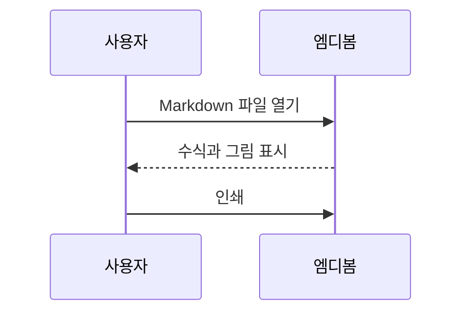

# 수식과 다이어그램

엠디봄은 수식, SVG 이미지, Mermaid 다이어그램을 인터넷 연결 없이 표시합니다.

## 수식

에너지와 질량의 관계는 $E = mc^2$입니다. 표본 평균은 다음과 같습니다.

$$
\bar{x} = \frac{1}{n}\sum_{i=1}^{n} x_i
$$

## 로컬 SVG


## 흐름도


## 순서도



## 원문 유지

인라인 코드 `$x^2$`와 일반 코드 블록은 수식으로 바꾸지 않습니다.

```text
$$
\frac{a}{b}
$$
```
