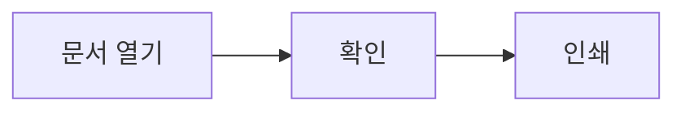

# 엠디봄 사용설명서

**1.0 베타 4 · 1.0.0-beta.4**

엠디봄은 Markdown 문서를 보기 좋게 읽는 앱입니다. 원본 파일은 수정하지 않으며, 인터넷 연결 없이 사용할 수 있습니다.

## 문서 열기

- 도구바의 **열기**를 누르거나 `.md` / `.markdown` 파일을 앱 창으로 끌어 놓으세요.
- 파일의 연결 프로그램을 엠디봄으로 지정하면 더블클릭으로 열 수 있습니다.
- 다른 편집기에서 저장하면 자동으로 새로고침됩니다. 필요하면 도구바의 새로고침 버튼을 누르세요.

## 보기와 분할

**문서**은 서식이 적용된 문서, **소스**는 Markdown 원문입니다. 두 화면 모두 읽기 전용입니다.

좌우 또는 상하 분할 버튼으로 두 화면을 함께 볼 수 있습니다. 가운데 경계선을 끌어 분할 비율을 바꾸세요. 스크롤 연결 버튼으로 함께 이동할지 선택할 수 있습니다. 분할 중 검색하면 대응되는 위치로 양쪽 화면이 이동합니다.

## 본문 폭

도구바의 **폭** 버튼을 누르면 폭 설정이 열립니다. 같은 버튼을 다시 누르면 닫힙니다.

문서와 소스의 폭을 각각 조절하세요. 위쪽은 문서, 아래쪽은 소스 설정입니다. 슬라이더와 좁게·기본·넓게 버튼을 사용할 수 있습니다. **창 너비에 맞춤**을 선택하면 해당 화면의 가용 너비를 모두 사용합니다. 설정한 폭보다 창이 좁으면 창 안에 맞춰 표시합니다.

## 글꼴과 크기

도구바의 **글꼴** 버튼에서 문서와 소스의 글꼴 및 크기를 따로 조절할 수 있습니다.

- 글꼴: 시스템 기본, 고딕, 명조, 고정폭
- 글자 크기: 12–28px
- 문서 안의 코드 블록은 고정폭 글꼴 유지

폭과 글꼴은 자동 저장됩니다. 각 영역의 **기본값으로** 버튼은 해당 패널의 설정만 초기화합니다. 시스템에 설치된 기본 글꼴을 사용하므로 운영체제에 따라 모양이 조금 다릅니다.

## 도구바·테마·전체화면

핀 버튼으로 도구바를 항상 표시하거나 자동으로 숨길 수 있습니다. 자동 숨김 상태에서는 화면 위쪽이나 **도구** 버튼으로 다시 표시하세요. 테마 버튼은 시스템·밝게·어둡게를 순서대로 전환합니다. 전체화면 버튼으로 화면을 넓게 사용할 수 있습니다.

폭·글꼴 패널은 바깥을 클릭하거나 Escape 키로 닫습니다. 도구바 맨 오른쪽의 **도움말(?)**로 이 설명서를 엽니다. 도움말은 닫기 버튼이나 Escape 키로 닫으면 읽던 문서로 돌아갑니다.

## 검색과 인쇄

검색 버튼으로 문서 안의 단어를 찾으세요. 소스 보기에서는 Markdown 문법도 검색할 수 있습니다.

**인쇄 · PDF** 버튼을 누르면 서식이 적용된 문서를 인쇄할 수 있습니다. 소스·분할 보기에서도 서식이 적용된 문서만 출력합니다. Mac에서는 인쇄 창의 PDF 메뉴, Windows에서는 PDF 프린터를 이용해 파일로 저장할 수 있습니다.

## 자주 쓰는 단축키

| 기능 | Mac | Windows |
| --- | --- | --- |
| 열기 | ⌘O | Ctrl+O |
| 검색 | ⌘F | Ctrl+F |
| 새로고침 | ⌘R | Ctrl+R / F5 |
| 인쇄 | ⌘P | Ctrl+P |
| 소스 전환 | ⌘U | Ctrl+U |
| 확대·축소 | ⌘+ / ⌘− | Ctrl+ / Ctrl− |
| 원래 배율 | ⌘0 | Ctrl+0 |
| 도구바 자동 숨김 전환 | ⌘⇧H | Ctrl+Shift+H |

## 지원 범위

표, 읽기 전용 체크리스트, 코드 강조, 한글 문서, 수식, Mermaid 다이어그램, 로컬 SVG 이미지를 지원합니다. 편집 기능은 제공하지 않습니다.

### 수식

문장 안에서는 `$E=mc^2$`처럼 달러 기호 하나로 감쌉니다. 독립된 수식은 다음과 같이 작성합니다.

```text
$$
\frac{1}{n}\sum_{i=1}^{n} x_i
$$
```

KaTeX가 지원하는 LaTeX 수식 문법을 사용합니다. 코드 블록과 인라인 코드 안의 수식은 변환하지 않습니다. 잘못된 수식은 원문으로 표시합니다.

### Mermaid 다이어그램

코드 블록의 언어를 `mermaid`로 지정합니다.

````text

````

그림 아래 **다이어그램 원문**을 눌러 코드를 확인할 수 있습니다. 검색은 이 원문에서도 찾습니다. 다이어그램의 설정 지시문, 클릭 동작, 외부 리소스는 지원하지 않습니다. 문서당 20개, 각 20,000자·연결 200개로 제한하며 표시가 어려우면 원문과 안내를 보여줍니다. 인쇄에는 그림만 포함됩니다.

### SVG 이미지

``처럼 문서 폴더 또는 하위 폴더의 SVG 파일을 사용합니다. 본문에 직접 넣은 `<svg>…</svg>` 태그는 표시하지 않습니다. SVG는 실행 가능한 웹 문서가 아닌 이미지로 표시합니다.

외부 이미지는 자동으로 불러오지 않습니다. 로컬 이미지는 문서 폴더와 하위 폴더에 있어야 합니다. 문서는 최대 10 MiB까지 열 수 있습니다. 문자 인코딩은 UTF-8 또는 BOM이 있는 UTF-16을 사용하세요.

베타 버전에서 문제가 생기면 문서의 재현 가능한 부분과 사용 환경을 함께 기록해 주세요. 문서 내용은 서버에 업로드되지 않습니다.
